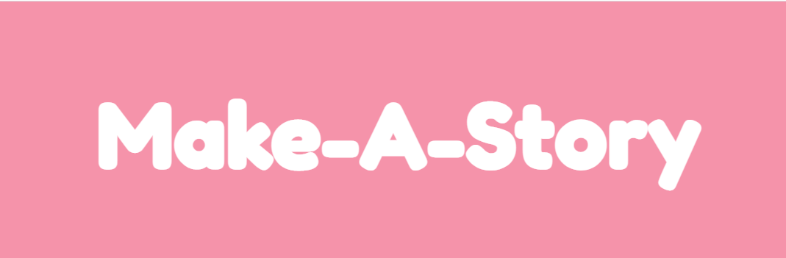
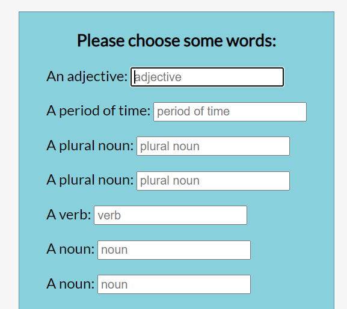
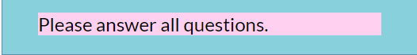
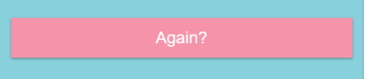

  

## Description  
A JavaScript Mad Libs-type application that allows users to enter words and then submit them to see a completed story.

## Table of Contents

* [Technologies Used](#technologies-used)

* [How to Use](#how-to-use)

* [How I Made This](#how-i-made-this)

* [Deployed Application](#link-to-deployed-application)

* [GitHub Repo](#link-to-github-repo)

* [Future Development Ideas](#future-development-ideas)  

## Technologies Used    
Built in Visual Studio with          
HTML       
CSS    
Javascript           

## How to Use      
Navigate to https://alyssahellrung.github.io/make-a-story/. On the first page you will see a series of prompts that ask you to enter certain kinds of words (adjectives, nouns, verbs, etc.).  
  
If you try to submit the inputs before filling them all in, an alert will come up that asks you to fill in every blank.  
  
Once you have filled in all of the blanks, click the submit button (or press enter) to see a completed story that uses the words you entered. If you would like to try again with different words, click the "Again" button at the end of the story.  

## How I Made This    
The main architecture of this app came from a YouTube Mad Libs tutorial by John McCaffrey. After writing the basic funcitonality of the app, I extended it to make a full story and changed the style so that it looked more inviting.

## Link to Deployed Application  
https://alyssahellrung.github.io/make-a-story/ 

## Link to GitHub Repo      
https://github.com/alyssahellrung/make-a-story

## Future Development Ideas     
--More stories! I would like for users to have different story options to choose from.   
--A lot of the code is very repetitive, so I would like to refactor it even further to make it more DRY.  

TEST